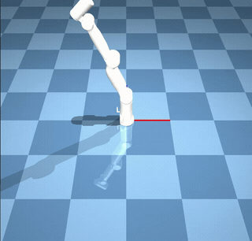
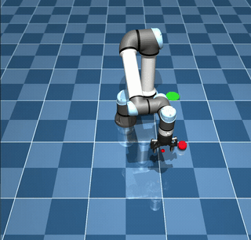
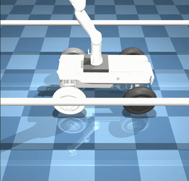
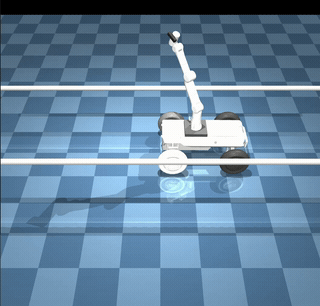
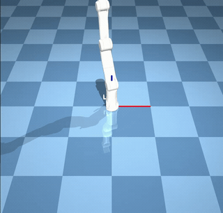
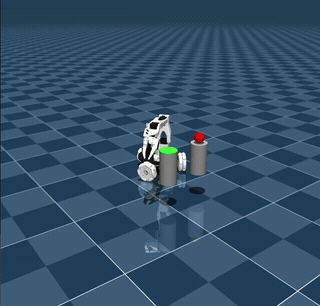
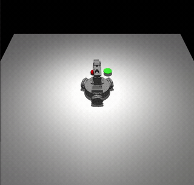
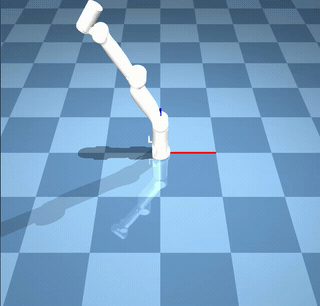
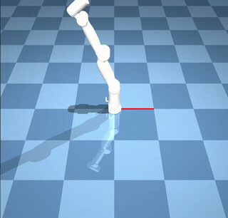

# Dora-MoveIt2 示例集

## 项目概述

Dora-MoveIt2 是一个基于 [dora-rs](https://github.com/dora-rs/dora) 数据流框架的机械臂运动规划库，提供类似 ROS MoveIt 的 API，但无需 ROS 依赖。系统通过 dora 数据流将逆运动学（IK）、路径规划、碰撞检测、轨迹执行等功能解耦为独立算子节点，支持单臂、双臂、移动操作平台等多种机器人构型。

```
┌─────────────────────────────────────────────────────────────────┐
│                    Dora-MoveIt2 系统架构                          │
├─────────────────────────────────────────────────────────────────┤
│                                                                 │
│  ┌──────────┐    ┌──────────┐    ┌──────────┐    ┌──────────┐  │
│  │ 用户应用  │───▶│ IK 求解器 │───▶│ 路径规划器│───▶│ 轨迹执行器│  │
│  │ (MoveGroup│    │          │    │ (OMPL)   │    │          │  │
│  │  API)    │    └──────────┘    └──────────┘    └──────────┘  │
│  └──────────┘         │               │               │        │
│       │               ▼               ▼               ▼        │
│       │         ┌──────────┐    ┌──────────┐    ┌──────────┐  │
│       └────────▶│ 规划场景  │◀──▶│ 碰撞检测  │    │ MuJoCo   │  │
│                 │ 管理器    │    │          │    │ 仿真环境  │  │
│                 └──────────┘    └──────────┘    └──────────┘  │
│                                                                 │
└─────────────────────────────────────────────────────────────────┘
```

---

## 核心理论：逆运动学 (Inverse Kinematics)

### 什么是逆运动学

逆运动学（IK）是机器人学中的核心问题：给定末端执行器（end-effector）的目标位姿（位置 + 姿态），求解各关节角度。与正运动学（已知关节角求末端位姿）相反，IK 通常是非线性、多解甚至无解的问题。

### 正运动学基础

正运动学（FK）是 IK 的基础。本项目使用齐次变换矩阵链计算末端位姿：

```
T_ee = T_link0 · R_joint0 · T_link1 · R_joint1 · ... · T_linkN · R_jointN · T_ee_offset
```

其中每个连杆变换 `T_link` 由 URDF 中的 xyz + rpy 定义，关节旋转 `R_joint` 使用 **Rodrigues 旋转公式**：

```
R(θ, k) = I + sin(θ)·K + (1 - cos(θ))·K²
```

其中 `K` 是旋转轴 `k` 的反对称矩阵。对于标准轴（X/Y/Z），退化为基本旋转矩阵。

**Jacobian 矩阵**通过有限差分数值计算（步长 δ = 1e-6），得到 6×N 矩阵（3 行位置 + 3 行姿态）：

```
J[i] = [FK(q + δ·eᵢ) - FK(q)] / δ
```

### IK 求解算法

本项目实现了三种 IK 求解策略，按级联方式依次尝试：

#### TracIK 混合求解器

TracIK 求解器结合三种策略，依次尝试直到成功：

**策略 1：Jacobian Newton-Raphson（阻尼最小二乘）**

核心迭代公式：

```
Δq = J^T · (J·J^T + λ·I)^{-1} · e
```

其中 `e` 为 6D 任务空间误差（3D 位置误差 + 3D 姿态误差），`λ = 0.01` 为阻尼系数防止奇异位形附近发散。步长 `α = 0.5`，最大迭代 1000 次，位置收敛阈值 1mm，姿态收敛阈值 0.01 rad。

**策略 2：L-BFGS-B 优化**

将 IK 转化为带关节限位约束的优化问题：

```
min  f(q) = ||p_target - FK(q)_pos|| + 0.1 · ||R_target - FK(q)_rot||_F
s.t. q_lower ≤ q ≤ q_upper
```

使用 scipy 的 L-BFGS-B 算法求解，最大迭代 500 次，函数容差 1e-6。

**策略 3：多起点随机采样**

在关节空间均匀随机采样多个初始构型（默认 3~5 次），对每个起点执行策略 1 的 Jacobian 求解，返回误差最小的结果。适用于当前构型远离目标时跳出局部最优。

#### 差分进化全局优化求解器

使用 scipy 的 `differential_evolution` 全局优化算法，适用于奇异位形或高度非线性区域：

- 种群大小：10
- 最大迭代：300
- 搜索范围：完整关节限位空间
- 优势：全局搜索能力强，不依赖初始值
- 劣势：计算速度较慢

#### 简单数值 IK 求解器

基础的 Jacobian 伪逆求解器，仅使用位置 Jacobian（3×N），适用于教学演示：

```
Δq = J_pos^T · (J_pos·J_pos^T + λ·I)^{-1} · e_pos
```

参数：步长 0.5，阻尼 0.001，最大迭代 500，位置容差 10mm。

### 算法对比表

| 算法 | 速度 | 鲁棒性 | 姿态约束 | 适用场景 |
|------|------|--------|----------|----------|
| TracIK（级联） | 快 | 高 | 支持 | 默认求解器，适用于大多数场景 |
| 差分进化 | 慢 | 很高 | 仅位置 | 奇异位形、极端构型 |
| 简单数值 IK | 最快 | 低 | 仅位置 | 教学演示、快速原型 |

---

## 核心理论：运动规划 (Motion Planning)

### 什么是运动规划

运动规划的目标是找到一条从起始构型到目标构型的无碰撞路径。

**配置空间 (C-space) vs 工作空间 (Workspace)**：
- 工作空间：机器人末端在 3D 笛卡尔空间中的位置
- 配置空间：所有关节角度组成的 N 维空间（7-DOF 机器人 → 7 维配置空间）
- 规划在配置空间中进行，碰撞检测将障碍物映射到配置空间

### RRT（快速随机探索树）

RRT 是一种基于采样的规划算法，通过随机探索配置空间快速构建搜索树：

```
算法流程：
1. 初始化树 T，根节点 = 起始构型
2. 循环（最大 5000 次迭代）：
   a. 以 10% 概率采样目标构型（goal bias），否则随机采样
   b. 找到树中距采样点最近的节点 q_near
   c. 从 q_near 向采样点步进（步长 0.2 rad），得到 q_new
   d. 若 q_near → q_new 路径无碰撞，将 q_new 加入树
   e. 若 q_new 距目标 < 容差（0.05 rad），尝试直连目标
3. 回溯提取路径，执行路径平滑
```

### RRT-Connect（双向 RRT，默认规划器）

RRT-Connect 从起点和终点同时生长两棵树，使用贪心连接策略加速收敛：

```
算法流程：
1. 初始化树 T_a（起点）和 T_b（终点）
2. 循环：
   a. 随机采样 q_rand
   b. 扩展 T_a 向 q_rand（单步）
   c. 贪心连接：T_b 持续向 T_a 的新节点步进，直到连接或碰撞
   d. 若两树连接成功 → 合并路径
   e. 交换 T_a 和 T_b（平衡生长）
3. 路径平滑 + 插值（10 个中间点/段）
```

**优势**：双向生长 + 贪心连接使其在大多数场景下比单向 RRT 快一个数量级。

### 碰撞检测

碰撞检测是规划器的核心回调函数 `is_state_valid()`，支持以下几何原语：

| 碰撞对 | 方法 |
|--------|------|
| 球-球 | 中心距 < 半径之和 |
| 球-盒 (AABB) | 球心到盒体最近点距离 < 半径 |
| 球-圆柱 | XY 平面距离 + Z 轴裁剪 |
| 盒-盒 (AABB) | 三轴分离轴测试 |
| 圆柱-圆柱 | Z 轴重叠 + XY 平面距离 |

**碰撞类型**：
- **自碰撞**：跳过运动链中相邻 2 个连杆（`j > i + 2`），检查所有非相邻连杆对
- **环境碰撞**：机器人所有连杆 × 所有环境障碍物
- **双臂互碰**：左臂所有连杆 × 右臂所有连杆（跳过两个基座连杆对）

默认碰撞安全边距：10mm。

### 规划场景管理

`PlanningScene` 算子是系统的"大脑"，维护：
- 世界物体列表（障碍物、桌面等）
- 机器人当前关节状态
- 附着物体（夹爪抓取的物体）

场景更新通过 dora 数据流广播给规划器和碰撞检测器，支持动态添加/移除障碍物。

### 路径平滑

使用 shortcut 方法对 RRT 生成的路径进行后处理：

```
循环 50 次：
  1. 随机选取路径上两个点 i, j（i < j）
  2. 若 path[i] → path[j] 直连无碰撞
  3. 则删除 i+1 到 j-1 之间的所有中间点
```

---

## 系统架构

### Dora 数据流节点关系

```
┌─────────────────────────────────────────────────────────────────────────┐
│                         Dora Dataflow Graph                             │
├─────────────────────────────────────────────────────────────────────────┤
│                                                                         │
│  ┌─────────────┐  ik_request   ┌─────────────┐  plan_request           │
│  │  Application │─────────────▶│  IK Solver  │──────────────┐          │
│  │  (MoveGroup) │              │  (TracIK)   │              │          │
│  │             │◀─────────────│             │              ▼          │
│  │             │  ik_solution  └─────────────┘     ┌─────────────┐    │
│  │             │                                    │   Planner   │    │
│  │             │◀──────────────────────────────────│ (RRT-Connect│    │
│  │             │  trajectory                       │  + Collision│    │
│  └──────┬──────┘                                    └──────┬──────┘    │
│         │                                                   │          │
│         │ joint_cmd        scene_update                     │          │
│         ▼                       ▲                           │          │
│  ┌─────────────┐         ┌─────┴───────┐    scene_update   │          │
│  │  Trajectory │         │  Planning   │◀──────────────────┘          │
│  │  Executor   │         │   Scene     │                              │
│  └──────┬──────┘         └─────────────┘                              │
│         │                                                              │
│         │ joint_positions                                              │
│         ▼                                                              │
│  ┌─────────────┐                                                       │
│  │   MuJoCo    │  (仿真环境 / 真实硬件驱动)                              │
│  │  Simulator  │                                                       │
│  └─────────────┘                                                       │
│                                                                         │
└─────────────────────────────────────────────────────────────────────────┘
```

---

## 示例总览

| # | 名称 | 机器人 | 目标 | 难度 |
|---|------|--------|------|------|
| 1 | UR5e Pick-and-Place | UR5e 6-DOF + Robotiq 2F-85 | 工业臂运动规划基础 | 入门 |
| 2 | GEN72 MoveGroup | GEN72 7-DOF | MoveGroup API 全功能展示 | 入门 |
| 3 | Standalone UR5e 可视化 | UR5e | 无 dora 纯 Python IK+规划演示 | 入门 |
| 4 | Hunter+GEN72 MoveGroup | Hunter SE + GEN72 | 移动操作平台 MoveGroup API | 进阶 |
| 5 | Hunter+GEN72 多视角采集 | Hunter SE + GEN72 | 编排式巡检 + 避障 | 进阶 |
| 6 | Standalone GEN72 | GEN72 | 单臂仿真基础 | 入门 |
| 7 | Physical GEN72 (Realman) | GEN72 实物 | 真实硬件控制 | 高级 |
| 8 | Dual GEN72 双臂 | 2×GEN72 (14-DOF) | 双臂协调 + 物体交接 | 高级 |
| 9 | LeKiwi Pick-and-Place | LeKiwi + SO_ARM100 | 移动机械臂抓取放置 | 进阶 |
| 10 | Nano Pick-and-Place | ADORA1 Nano 6-DOF | 小型臂关节空间抓取 | 入门 |
| 11 | GEN72 单臂抓取 | GEN72 | 抓取演示 | 进阶 |
| 12 | GEN72 单臂避障 | GEN72 | 障碍物规避演示 | 进阶 |
| 13 | Dual GEN72 实物模板 | 2×GEN72 实物 | 双臂硬件控制模板 | 高级 |

---

## 示例详解

### Demo #1：UR5e Pick-and-Place

**参考演示**：


**目标**：展示工业 6-DOF 机械臂的基本运动规划与抓取放置流程。

**演示内容**：
- UR5e 机械臂在 MuJoCo 仿真中执行 pick-and-place
- Robotiq 2F-85 夹爪开合控制
- 关节空间与笛卡尔空间目标规划
- RRT-Connect 路径规划 + 碰撞避障

**关键概念**：正/逆运动学、RRT-Connect 规划、关节限位约束

**运行命令**：
```bash
cd /home/demo/dora-moveit2/examples/move_group_demo
dora up
dora start dataflows/ur5e_example_mujoco.yml
dora stop
```

**源码路径**：
- 配置：`examples/move_group_demo/move_group_demo/config/ur5e.py`
- 应用：`examples/move_group_demo/move_group_demo/nodes/ur5e_moveit_example.py`
- 数据流：`examples/move_group_demo/dataflows/ur5e_example_mujoco.yml`

**难度**：入门

---

### Demo #2：GEN72 MoveGroup Example（课程 Ch1, Ch5）

**参考演示**：



**目标**：完整展示 MoveGroup API 的五大功能，是课程教学的核心示例。

**演示内容**：
- 命名位姿（Named Poses）：home、safe 等预定义构型
- 关节目标（Joint Goals）：精确关节角度控制
- 笛卡尔路径（Cartesian Paths）：末端直线/圆弧运动
- 碰撞物体管理：动态添加/移除障碍物
- 附着物体（Attached Objects）：模拟抓取

**关键概念**：MoveGroup API 设计模式、TracIK 求解器、规划场景管理

**运行命令**：
```bash
cd /home/demo/dora-moveit2/examples/move_group_demo
dora up
dora start dataflows/moveit_example_mujoco.yml
dora stop
```

**源码路径**：
- 应用：`examples/move_group_demo/move_group_demo/nodes/moveit_example.py`
- 数据流：`examples/move_group_demo/dataflows/moveit_example_mujoco.yml`

**难度**：入门

---

### Demo #3：Standalone UR5e Pick-and-Place 可视化

**参考演示**：



**目标**：无需 dora 框架，纯 Python 脚本演示 IK + 路径规划 + MuJoCo 可视化。

**演示内容**：
- 独立运行的 MuJoCo 可视化窗口
- 内置 IK 求解 + 路径插值
- 适合快速理解算法原理，无需理解 dora 数据流

**关键概念**：正运动学链、MuJoCo 仿真 API

**运行命令**：
```bash
cd /home/demo/dora-moveit2/examples/move_group_demo/models

# macOS
mjpython pick_and_place_demo.py

# Linux
python3 pick_and_place_demo.py
```

**源码路径**：
- 脚本：`examples/move_group_demo/models/pick_and_place_demo.py`

**难度**：入门

---

### Demo #4：Hunter SE + GEN72 — MoveGroup API Demo

**参考演示**：



**目标**：在移动操作平台上使用 MoveGroup API 控制机械臂。

**演示内容**：
- Hunter SE 移动底盘 + GEN72 7-DOF 机械臂联合仿真
- 移动平台上的臂部运动规划
- 与 Demo #2 相同的 MoveGroup API，不同的机器人构型

**关键概念**：移动操作（Mobile Manipulation）、平台坐标系变换

**运行命令**：
```bash
cd /home/demo/dora-moveit2/examples/hunter_with_arm
dora up
dora start dataflows/movegroup_mujoco.yml
dora stop
```

**源码路径**：
- 应用：`examples/hunter_with_arm/hunter_arm_demo/nodes/example_movegroup.py`
- 数据流：`examples/hunter_with_arm/dataflows/movegroup_mujoco.yml`

**难度**：进阶

---

### Demo #5：Hunter SE + GEN72 — 编排式多视角采集

**参考演示**：



**目标**：展示移动平台 + 机械臂的编排式巡检任务，多视角图像采集。

**演示内容**：
- 底盘移动到预设巡检点
- 机械臂在每个巡检点执行多角度拍摄
- 运动规划避障（管道环境）
- 多视角图像采集与存储

**关键概念**：任务编排、多视角采集、移动+操作协调

**运行命令**：
```bash
cd /home/demo/dora-moveit2/examples/hunter_with_arm
dora up
dora start dataflows/hunter_arm_mujoco.yml
dora stop
```

**源码路径**：
- 应用：`examples/hunter_with_arm/hunter_arm_demo/nodes/multi_view_capture_node.py`
- 数据流：`examples/hunter_with_arm/dataflows/hunter_arm_mujoco.yml`

**难度**：进阶

---

### Demo #6：Standalone GEN72 Arm

**参考演示**：



**目标**：单独运行 GEN72 机械臂仿真，不含移动底盘。

**演示内容**：
- GEN72 7-DOF 机械臂独立仿真
- 基本运动控制与 MuJoCo 可视化
- 适合专注于臂部算法开发

**关键概念**：GEN72 运动学模型、关节空间控制

**运行命令**：
```bash
cd /home/demo/dora-moveit2/examples/hunter_with_arm
dora up
dora start dataflows/gen72_mujoco.yml
dora stop
```

**源码路径**：
- 数据流：`examples/hunter_with_arm/dataflows/gen72_mujoco.yml`
- 机器人驱动：`examples/hunter_with_arm/hunter_arm_demo/robot_control/gen72_robot_node.py`
- 模型：`examples/hunter_with_arm/models/GEN72_base.xml`

**难度**：入门

---

### Demo #7：Physical GEN72 Arm via Realman SDK

**参考演示**：


**目标**：通过 Realman SDK 控制真实 GEN72 机械臂硬件。

**演示内容**：
- 连接真实 GEN72 机械臂（需要硬件）
- Realman SDK 驱动层
- 与仿真相同的 MoveGroup API，无缝切换

**关键概念**：硬件驱动抽象、仿真-实物迁移（Sim-to-Real）

**运行命令**：
```bash
cd /home/demo/dora-moveit2/examples/hunter_with_arm
dora up
dora start dataflows/gen72_real.yml
dora stop
```

> ⚠ 需要真实硬件和 Realman SDK。

**源码路径**：
- 数据流：`examples/hunter_with_arm/dataflows/gen72_real.yml`
- 硬件驱动：`examples/hunter_with_arm/hunter_arm_demo/robot_control/gen72_robot_node.py`

**难度**：高级

---

### Demo #8：Dual GEN72 双臂协调（课程 Ch7, Ch8）

**参考演示**：


**目标**：展示双臂协调运动规划，包括物体交接、同步运动等高级功能。

**演示内容**：
- 两台 GEN72 7-DOF 机械臂（共 14-DOF）协调控制
- 双臂 IK 求解（JSON 格式 left_pose / right_pose）
- 14 维联合配置空间路径规划
- 双臂互碰检测
- 物体从左臂交接到右臂

**关键概念**：双臂协调、联合配置空间规划、互碰检测、DualMoveGroup API

**运行命令**：
```bash
cd /home/demo/dora-moveit2/examples/dual_gen72
dora up
dora start dataflows/dual_gen72_mujoco.yml
dora stop
```

**源码路径**：
- 应用：`examples/dual_gen72/dual_gen72_demo/nodes/dual_arm_final_demo.py`
- 双臂 MoveGroup：`dora_moveit/dora_moveit/workflow/dual_move_group.py`
- 数据流：`examples/dual_gen72/dataflows/dual_gen72_mujoco.yml`
- 模型：`examples/dual_gen72/models/dual_gen72.xml`

**难度**：高级

---

### Demo #9：LeKiwi Pick-and-Place

**参考演示**：



**目标**：展示 LeKiwi 移动平台 + SO_ARM100 机械臂的抓取放置任务。

**演示内容**：
- LeKiwi 全向移动底盘控制
- SO_ARM100 机械臂抓取放置
- 移动 + 抓取的完整流程编排
- 小型移动操作平台的运动规划

**关键概念**：全向移动平台、小型臂运动规划、任务编排

**运行命令**：
```bash
cd /home/demo/dora-moveit2/examples/lekiwi_pick_place
dora up
dora start dataflows/lekiwi_pick_place_mujoco.yml
dora stop
```

**源码路径**：
- 应用：`examples/lekiwi_pick_place/lekiwi_pick_place/nodes/lekiwi_pick_place_example.py`
- 数据流：`examples/lekiwi_pick_place/dataflows/lekiwi_pick_place_mujoco.yml`
- 模型：`examples/lekiwi_pick_place/models/lekiwi_scene.xml`

**难度**：进阶

---

### Demo #10：Nano Pick-and-Place (ADORA1 Nano)

**参考演示**：



**目标**：展示小型 6-DOF 机械臂的关节空间抓取放置。

**演示内容**：
- ADORA1 Nano 6-DOF 小型机械臂
- 关节空间直接规划（无笛卡尔约束）
- 简洁的 pick-and-place 流程
- 适合入门学习运动规划基础

**关键概念**：关节空间规划、小型臂运动学、基础抓取策略

**运行命令**：
```bash
cd /home/demo/dora-moveit2/examples/nano_pick_place
dora up
dora start dataflows/nano_pick_place_mujoco.yml
dora stop
```

**源码路径**：
- 应用：`examples/nano_pick_place/nano_pick_place/nodes/nano_pick_place_example.py`
- 数据流：`examples/nano_pick_place/dataflows/nano_pick_place_mujoco.yml`

**难度**：入门

---

### Demo #11：GEN72 单臂抓取（课程 Ch6.4）

**参考演示**：



**目标**：展示单臂抓取任务的完整流程，包括接近、抓取、提升。

**演示内容**：
- 目标物体识别与定位
- 抓取前接近规划（pre-grasp approach）
- 夹爪闭合抓取
- 提升与搬运

**关键概念**：抓取规划、pre-grasp 姿态、力/位混合控制概念

**运行命令**：
```bash
cd /home/demo/dora-moveit2/examples/move_group_demo
dora up
dora start dataflows/single_arm_grasping_mujoco.yml
dora stop
```

**源码路径**：
- 数据流：`examples/move_group_demo/dataflows/single_arm_grasping_mujoco.yml`

**难度**：进阶

---

### Demo #12：GEN72 单臂避障（课程 Ch6.5）

**参考演示**：



**目标**：展示在有障碍物环境中的运动规划与避障能力。

**演示内容**：
- RRT-Connect 在障碍物环境中规划无碰撞路径
- 碰撞检测可视化
- 对比有/无障碍物时的路径差异

**关键概念**：碰撞检测、规划场景动态更新、C-space 障碍物映射

**运行命令**：
```bash
cd /home/demo/dora-moveit2/examples/move_group_demo
dora up
dora start dataflows/single_arm_avoidance_mujoco.yml
dora stop
```

**源码路径**：
- 数据流：`examples/move_group_demo/dataflows/single_arm_avoidance_mujoco.yml`

**难度**：进阶

---

### Demo #13：Dual GEN72 — 实物硬件模板（课程 Ch8.6）

**参考演示**：


**目标**：提供双臂真实硬件控制的代码模板，需用户自行完成驱动层。

**演示内容**：
- 双臂硬件控制的完整数据流模板
- Realman SDK 双臂驱动桩代码
- 与仿真 Demo #8 相同的上层 API
- 需要填写 IP 地址和完成驱动实现

**关键概念**：Sim-to-Real 迁移、硬件驱动抽象、双臂硬件同步

**运行命令**：
```bash
cd /home/demo/dora-moveit2/examples/dual_gen72
dora up
dora start dataflows/dual_gen72_real.yml
dora stop
```

> ⚠ **硬件模板**：不能在仿真中运行。需要：(1) 安装 Realman SDK，(2) 完成 `realman_dual_driver.py` 驱动实现，(3) 在 YAML 中设置 `GEN72_LEFT_IP` / `GEN72_RIGHT_IP`。

**源码路径**：
- 驱动桩：`examples/dual_gen72/dual_gen72_demo/nodes/realman_dual_driver.py`
- 数据流：`examples/dual_gen72/dataflows/dual_gen72_real.yml`

**难度**：高级

---

## 课程章节对照表

| 课程章节 | 对应 Demo | 说明 |
|----------|-----------|------|
| Ch1 环境验证 | Demo #2 | 运行 GEN72 MoveGroup 验证安装 |
| Ch5 MoveGroup API | Demo #2 | 五大功能完整演示 |
| Ch6.4 单臂抓取 | Demo #11 | 抓取规划实践 |
| Ch6.5 单臂避障 | Demo #12 | 碰撞检测与避障实践 |
| Ch7/Ch8 双臂协调 | Demo #8 | 双臂仿真 + 物体交接 |
| Ch8.6 硬件模板 | Demo #13 | 双臂实物控制（模板） |

学生自定义代码（Ch5/Ch6 课后练习）请参考 `run.md` 中的 "Write Your Own MoveGroup Script" 部分。

---

## 创建新示例

Each example is a self-contained application that imports `dora_moveit` as a library.

### Minimal structure

```
examples/
  my_robot/
    pyproject.toml              # depends on dora-moveit
    my_robot_demo/
      __init__.py
      config/
        __init__.py
        my_robot.py             # RobotConfig class (joints, limits, geometry)
      nodes/
        __init__.py
        planner.py              # thin wrapper: from dora_moveit.motion_planner... import main; main()
        ik_solver.py            # thin wrapper
        planning_scene.py       # thin wrapper
        trajectory_executor.py  # thin wrapper
        my_app_node.py          # your application logic
    models/                     # URDF, MuJoCo XML, meshes
    dataflows/                  # Dora dataflow YAMLs
```

### Key steps

1. **Define your robot config** — create a class satisfying the `RobotConfig` protocol (see `dora_moveit/dora_moveit/config.py`):
   ```python
   class MyRobotConfig:
       NUM_JOINTS = 6
       JOINT_LOWER_LIMITS = np.array([...])
       JOINT_UPPER_LIMITS = np.array([...])
       LINK_TRANSFORMS = [...]
       COLLISION_GEOMETRY = [...]
       HOME_CONFIG = np.array([...])
       SAFE_CONFIG = np.array([...])
       NAMED_POSES = {"home": np.array([...])}
       # ... see RobotConfig protocol for full list
   ```

2. **Create thin wrapper scripts** for library operators:
   ```python
   # my_robot_demo/nodes/planner.py
   from dora_moveit.motion_planner.planner_ompl_with_collision_op import main
   main()
   ```

3. **Set `ROBOT_CONFIG_MODULE`** in your dataflow YAML:
   ```yaml
   - id: planner
     path: ../my_robot_demo/nodes/planner.py
     env:
       ROBOT_CONFIG_MODULE: "my_robot_demo.config.my_robot"
   ```

4. **Install and run**:
   ```bash
   pip install -e dora_moveit/
   pip install -e examples/my_robot/
   cd examples/my_robot
   dora up && dora start dataflows/my_dataflow.yml
   ```

See [hunter_with_arm](hunter_with_arm/) for a complete working example.

